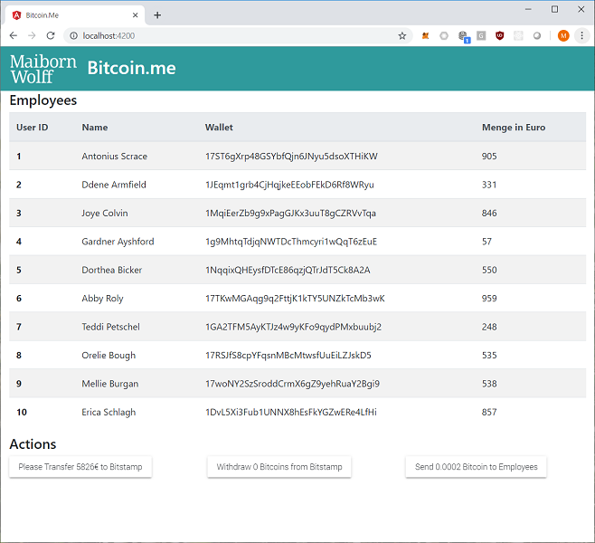

# bitcoin.me
Simple webapplication that enables you to pay your employees with bitcoin.

**Contents:**

* frontend: Angular based for easy interaction with APIs provided by backend

* backend: API provider



## Getting Started

Get a local copy of the repository, master branch is the latest version available:

```
git clone https://github.com/MaibornWolff/bitcoin.me.git
```

### Installing

Please refer to the README.md file of the folders ./frontend and ./backend Have fun! :)

## Contributing

Please read [CONTRIBUTING.md](CONTRIBUTING.md) for details on our code of conduct, and the process for submitting pull requests.

## Versioning

We use [SemVer](http://semver.org) for versioning. For the versions available, see the [tags on this repository](tags).

## License

This project is licensed under the MIT License - see the [LICENSE.md](LICENSE.md) file for details.

Developed with :green_heart: by [MaibornWolff](https://www.maibornwolff.de)